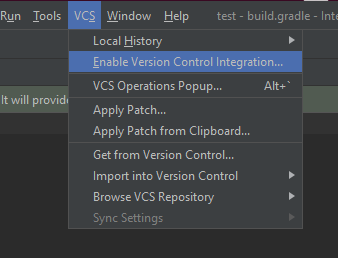
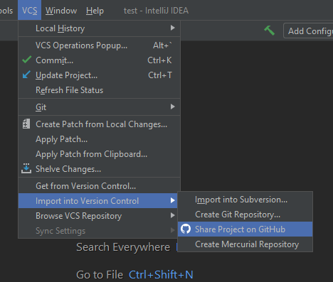

# Share project on GitHub
1. Go to `VCS/Enable Version Control Integration...`

2. Select `Git` on the pop-up window

3. Create `.gitignore` file if necessary

4. Go to `VCS/Import into Version Control/Share Project on GitHub`

5. Authenticate and select repository name